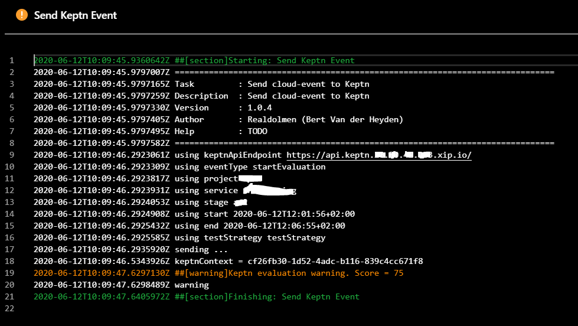

# AzureDevOps Keptn Integration

Integration of Keptn within your TFS/VSTS/AZDO build. 

This extension includes 3 tasks which can be used to integrate your pipeline with the keptn capabilities.
- Prepare Keptn environment
- Send Keptn event
- Wait for Keptn event

## The service endpoint
First of all you need to configure the Keptn endpoint as a `service connection`.

All you need is to configure is the API endpoint and the token. 
> **Tip:** If you are using the keptn cli, they can be found in the $home/.keptn/.keptn file. 

## Prepare Keptn environment
This task is optional, but very usefull since it prepares a project, stage and service for you. It also puts these entities as variables on the pipeline for later use by the other tasks.

When you flag the Create/Initalize flag, you will see following in the keptn bridge if the project did not yet exist.

It's not in the screenshot, but there is also a section where you could configure monitoring via dynatrace or prometheus and upload an sli and slo file. See https://keptn.sh/docs/0.6.0/usecases/quality-gates/ for more details on Service Level Indicators and Service Level Objectives.

## Send Keptn event
The main task in this extension.
- By sending the `configuration-changed` cloud-event to Keptn, you can trigger Keptn to perform a deployment. (not yet implemented)
- By sending the `deployment-finished` cloud-event to Keptn, you can trigger your load / performance tests to be executed. (not yet implemented)
- By sending the `start-evaluation` cloud-event to Keptn, you can trigger Lighthouse to perform automatic validation of your performance tests.

start-evaluation requires some extra parameters:
- `startTime`: format needs to be "yyyy-MM-ddTHH:mm:sszzz"
- `endTime`: format needs to be "yyyy-MM-ddTHH:mm:sszzz"
- `strategy`: by default performance

> **Note:** the start and end time for the evaluation probably will come via variables from a previous task running the load tests. If you enter it manually for some reason Azure DevOps changes the date format. Which is again not recognized by keptn.

Note that you can just flag "wait for evaluation done" when you want to wait for the evaluation and pass / fail accordingly. See next task for more details

## Wait for Keptn event
This task listens for some time for a specific keptn event. Currently only evaluation-done is supported. It waits for 10 seconds max.
Prerequisite of this task is the Send Keptn Event task which puts the keptnContext as a variable on the pipeline. This task uses this variable to capture the result.

In case of evaluation-done, it will give a warning whenever the lighthouse service did not indicate a 'pass'. So both warning as error in keptn will result in a 'succeeded with issues' here.

## Release notes ##
> **1.0.0**
> - First draft version

> **0.1.4**
> - First public version

> **0.1.5**
> - Added SLI and SLO upload

Created by `Bert Van der Heyden, RealDolmen - a GFI group company`.
Also available via the MarketPlace: https://marketplace.visualstudio.com/items?itemName=RealdolmenDevOps.keptn-integration
